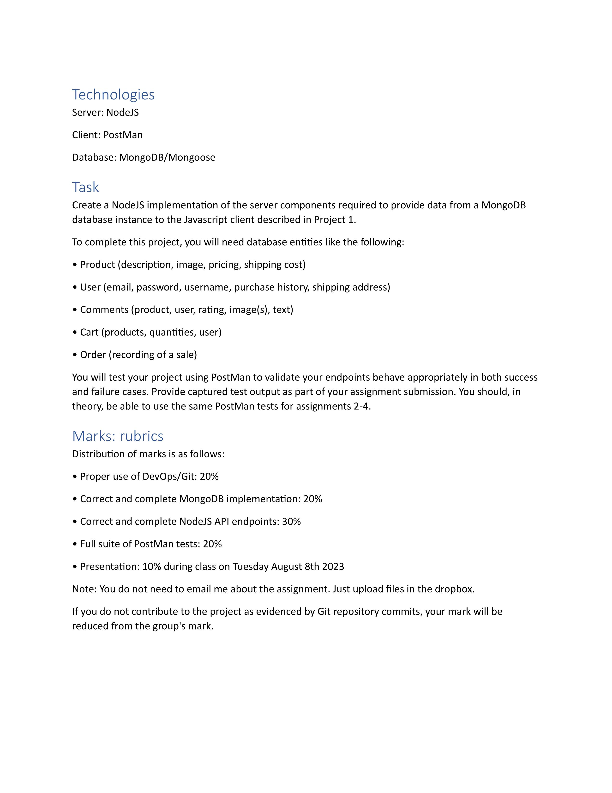
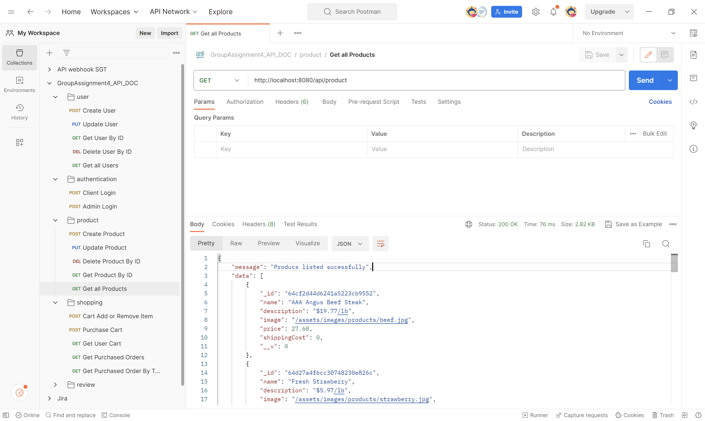
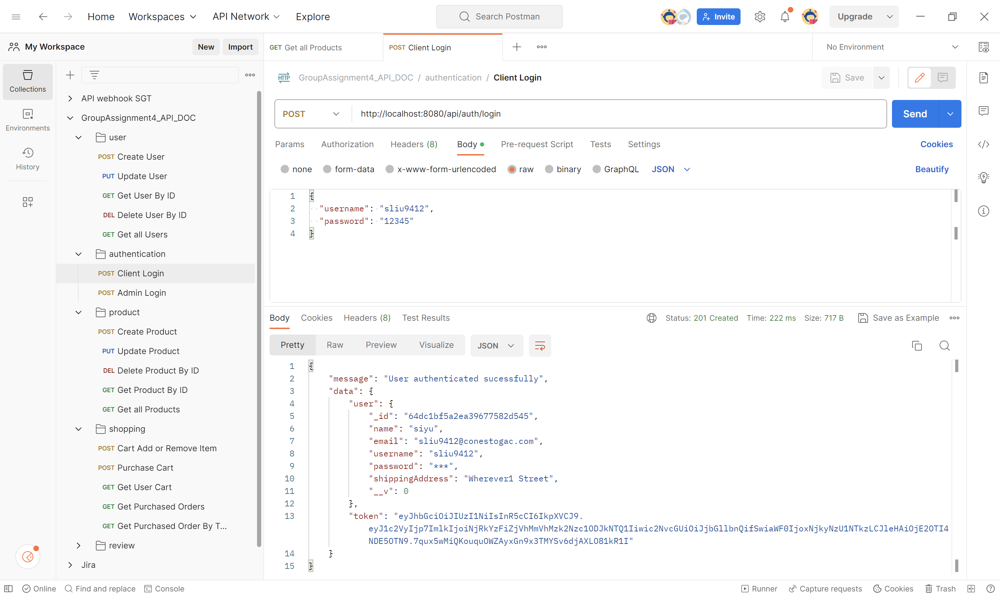
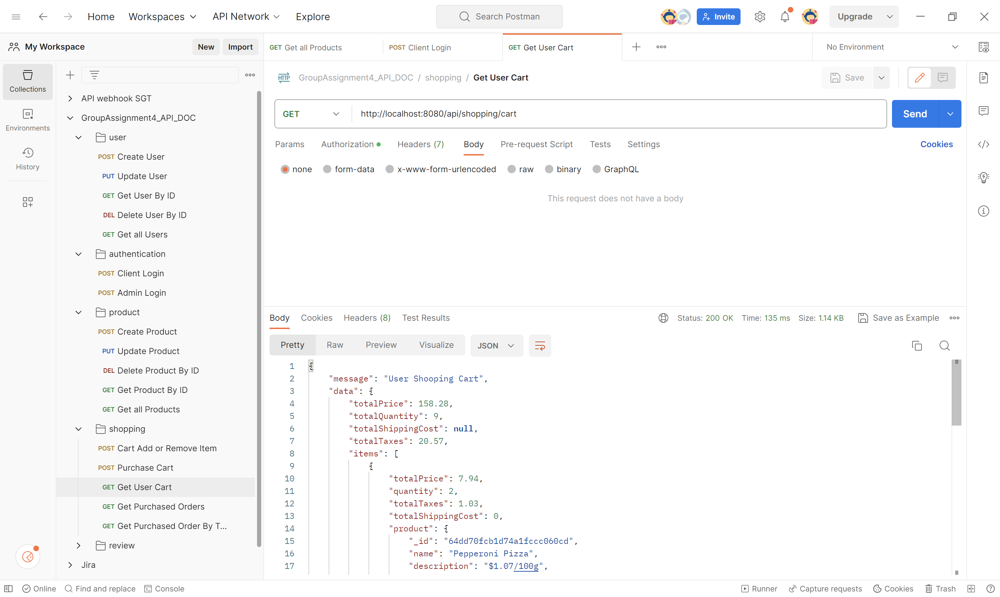

# PROG8185-23S-Sec1-Web-Technologies-Assignment3-Express.js-Store-APIs

The Assignment 4 of Conestoga College PROG8185-23S-Sec1 Web Technologies Course. This project has the same content in comparison with the Assignment 2, but it was refactored by Express.js microservice.

## Requirements

## Preview (POSTMAN)

### Exported APIs (JSON file)

[GroupAssignment4_API_DOC.postman_collection.json](./doc/GroupAssignment4_API_DOC.postman_collection.json)
